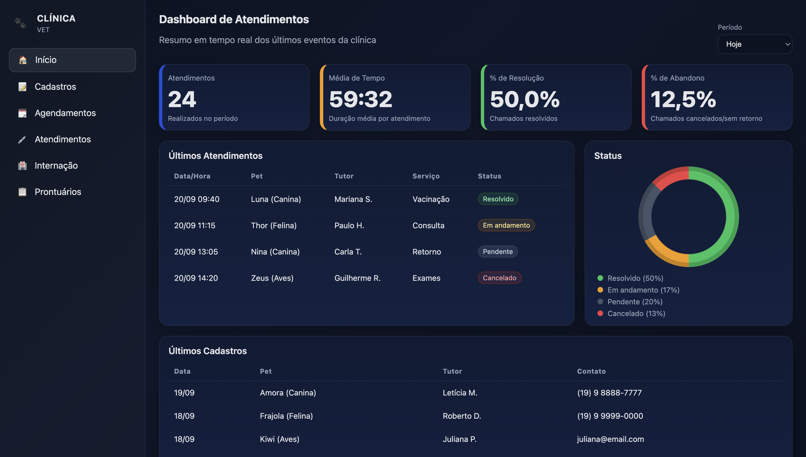

# Sistema de Gestão para Clínicas Veterinárias
**SCC0219 - Introdução ao Desenvolvimento Web**
Profa. Dra. Bruna Carolina Rodrigues da Cunha
Primeira entrega: 15/09/2025

## 👥 Membros
- Guilherme Augusto Fincatti da Silva — 13676986
- Marco Antonio Gaspar Garcia — 11833581
- Pedro Guilherme de Barros Zenatte — 13676919

Alunos de Engenharia de Computação da USP São Carlos.

| [<br><sub>Guilherme Fincatti</sub>](https://github.com/GuilhermeFincatti) | [<br><sub>Marco Garcia</sub>](https://github.com/marcogarcia2) | [<br><sub>Pedro Zenatte</sub>](https://github.com/pedrozenatte) |
| :---: | :---: | :---: |

---

## 📌 Descrição
A ideia central é fornecer um **site gratuito** de organização e gerenciamento para veterinários e clínicas veterinárias.
O sistema visa facilitar a gestão de cadastros, agendamentos e atendimentos, oferecendo uma interface web responsiva e integrada a um backend robusto.

---

## 🛠️ Tecnologias Utilizadas

O projeto foi desenvolvido utilizando as seguintes tecnologias:

### Frontend
- **HTML5** e **CSS3**: Estrutura e estilização das páginas.
- **JavaScript (ES6+)**: Lógica de interface e interatividade.

### Backend
- **Node.js**: Ambiente de execução JavaScript.
- **Express.js**: Framework web para criação das APIs RESTful.
- **Supabase**: Plataforma utilizada como Backend-as-a-Service (BaaS), provendo banco de dados (PostgreSQL) e serviços de autenticação.
- **CORS**: Middleware para controle de acesso HTTP.
- **Dotenv**: Gerenciamento de variáveis de ambiente.

### Ferramentas
- **Git & GitHub**: Controle de versão e colaboração.

---

## ✅ Funcionalidades

O sistema encontra-se em desenvolvimento. Abaixo está o status das funcionalidades planejadas:

### 🚀 Funcionalidades Implementadas
- **Autenticação e Cadastro**: Sistema de login e registro de usuários.
- **Gestão de Tutores e Pets**:
  - Cadastro completo de tutores.
  - Cadastro de animais vinculados aos tutores.
  - Edição e visualização de dados.
- **Agendamentos**:
  - Criação de novos agendamentos para consultas.
  - Visualização da agenda.
- **Atendimentos**:
  - Registro de atendimentos clínicos realizados.
- **Dashboard**:
  - Painel administrativo para visão geral do sistema.

### 🚧 Funcionalidades Não Implementadas / Futuras
- **Prontuário Eletrônico**: Histórico médico detalhado dos animais.
- **Internação**: Módulo para gestão de animais internados e acompanhamento de estado.

---

## 🚀 Como Rodar o Projeto

Siga os passos abaixo para executar o ambiente de desenvolvimento:

1. **Clone o repositório:**
   ```bash
   git clone https://github.com/pedrozenatte/Sistema-para-Clinica-Veterinaria.git
   cd sistema_clinica_vet
   ```

2. **Instale as dependências:**
   ```bash
   npm install
   ```

3. **Configure as Variáveis de Ambiente:**
   Crie um arquivo `.env` na raiz do projeto e adicione as credenciais do seu projeto Supabase:
   ```env
   SUPABASE_URL=sua_url_do_supabase
   SUPABASE_SERVICE_ROLE=sua_chave_service_role
   # ou
   SUPABASE_ANON_KEY=sua_chave_anonima
   ```

4. **Inicie o servidor:**
   ```bash
   npm run dev
   ```

5. **Acesse a aplicação:**
   Abra o navegador em `http://localhost:3000`

---

## 📸 Visualização
